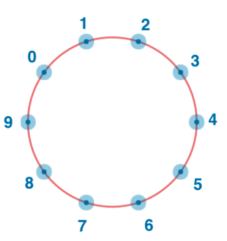

# 程序设计

#### 1. 想象 0 到 n-1 个人围成一个圈，每个人中的距离是相等的，试求出第 firstNumber 号对面的人是几号。

> 输入：n = 10, firstNumber = 2  
> 输出：7  
> 解释：此例中 n=10, firstNumber=2 时，正对面的人为 7 号，因此你的程序应输出 7

<!--  -->


```javascript
function foo(n, firstNumber) {
  let targetNumber;
  let _half = n / 2;

  if (_half > firstNumber) {
    targetNumber = firstNumber + _half;
  } else {
    targetNumber = firstNumber - _half;
  }

  return targetNumber;
}
```
